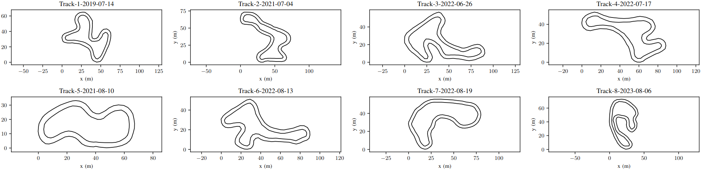

# FSD Racetrack Dataset



This is an open dataset of Formula Student racetrack layouts by StarkStrom Augsburg.
We collected this data during test drives using real sensor data, i.e. LiDAR. 
Currently it contains 9 tracks with their two boundaries and the SLAM-maps. 

# Data Format

The SLAM-maps are a YAML-list of the 2D-positions of every cone, additionally every cone has an ID.
The boundaries are two YAML-lists of ID's. 

The maps may contain false-positives, the ground-truth boundaries were annotated manually.
The accuracy of the cone positions is 0.2m - 0.3m.

# Publication 
This dataset was published supplementing our paper that demonstates a machine learning approach for lane detection, tailored to formula student:

[Lane Detection using Graph Search and Geometric Constraints for Formula Student Driverless](https://arxiv.org/abs/2405.16369) 

If you find this useful, consider citing our paper:
```
@misc{ivanov2024lanedetectionusinggraph,
      title={Lane Detection using Graph Search and Geometric Constraints for Formula Student Driverless}, 
      author={Ivo Ivanov and Carsten Markgraf},
      year={2024},
      eprint={2405.16369},
      archivePrefix={arXiv},
      primaryClass={cs.RO},
      url={https://arxiv.org/abs/2405.16369}, 
}
```

# License 

This dataset is released under the LGPLv3 license.
